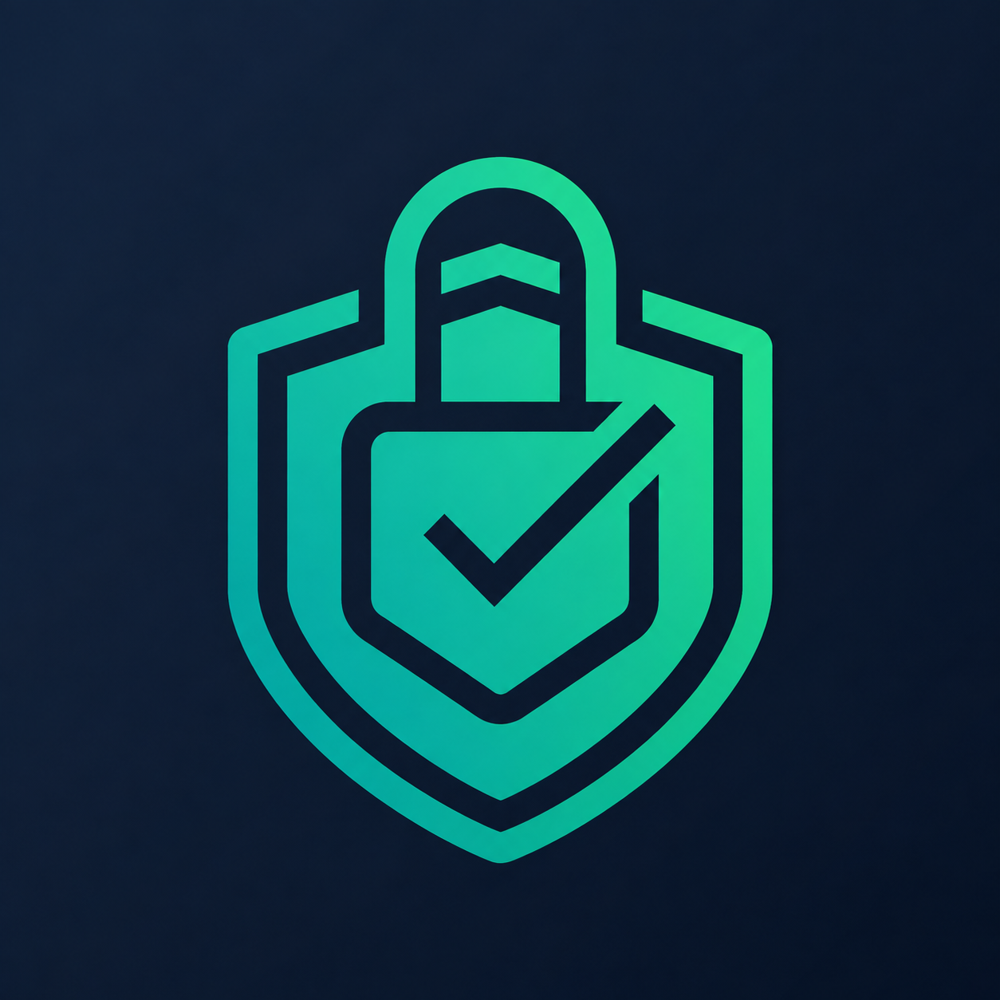

  
  <h1>SecureSyncZ</h1>
  
<strong>Secure Password & Credit Card Vault</strong>

---

## 🛡️ Overview

**SecureSyncZ** is a premium, beautifully designed digital vault for securely storing and managing your passwords, credit cards, and notes. Built with modern web technologies and a mobile-first approach, it features a glassmorphism UI, smooth micro-animations, and PWA capabilities—ensuring your sensitive data is always accessible and secured with military-grade encryption.

## ✨ Features

- **📱 Mobile-First Design:** Fully responsive, native-like mobile experience with scalable bottom navigation, touch-friendly swipeable alerts, and scrollable modals.
- **🎨 Premium UI/UX:** Dark mode by default, glassmorphism elements, dynamic glowing effects, and clean iOS-inspired forms.
- **🌐 Progressive Web App (PWA):** Install SecureSyncZ on your home screen for offline access and a native app feel.
- **💳 Comprehensive Vault:** Safely manage Passwords, Credit Cards, and Secure Notes with Tag/Category organization and Favorites.
- **🛡️ Password Health Dashboard:** Built-in dashboard to detect weak, reused, and old passwords.
- **🔍 Global Search:** Instantly find your credentials from anywhere using the Cmd+K Command Palette.
- **🔒 Zero-Knowledge Backups:** Export your entire vault as a single encrypted JSON file. Import via Drag-and-Drop.
- **🖼️ Profile Customization:** Custom avatars with automatic client-side image compression.

## 🛠️ Tech Stack

- **Framework:** Next.js 16 (App Router & Turbopack)
- **Styling:** Tailwind CSS v4
- **Database:** MongoDB
- **State/Fetching:** React Query (@tanstack/react-query)
- **Authentication:** Custom JWT-based Auth
- **Icons:** Lucide React
- **UI Components:** shadcn/ui

## 🚀 Why Use SecureSyncZ?

SecureSyncZ is built for users who want complete control over their digital life without sacrificing user experience. Traditional password managers can be clunky or expensive. SecureSyncZ provides a free, incredibly smooth, and aesthetically pleasing interface that feels like a premium native application, while giving you the peace of mind that nobody—not even the server administrators—can access your data.

## 🔐 Why It Is Secure (Security Architecture)

- **Zero-Knowledge Encryption:** Your data is encrypted locally on your device _before_ it reaches the server using AES-GCM 256-bit encryption. The keys are derived using PBKDF2. We never see your raw data.
- **Two-Secret Security Model:** Your vault is protected by a combination of your Master Password and an unrecoverable 64-character device-level Secret Key. Both are required to decrypt your data.
- **Secret Key Validation System:** Automatically verifies your 64-character Secret Key on new devices to prevent accidental lockouts or garbage data decryption using a secure validation challenge.
- **Advanced Passkeys:** Access your vault quickly and securely with a lightning-fast 6-digit passkey PIN that is verified on the server via bcrypt hashing.
- **Email Verification & OTP:** Requires users to verify their identity via Email OTP before performing sensitive actions like account deletion.
- **Auto-Lock:** Automatically secures your vault and clears the decryption keys from memory after 3 minutes of inactivity.

## 👨‍💻 Author / Credits

**MD. SAIF ISLAM**

- **Portfolio / Contact:** [developer-saif.vercel.app](https://developer-saif.vercel.app/)
- **GitHub:** [@muhammadsaif7717](https://github.com/muhammadsaif7717)

Feel free to reach out through my portfolio if you have any questions, feedback, or want to collaborate!

## 📄 License

This project and its source code are **strictly proprietary and confidential**.

While users are completely free to use the hosted SecureSyncZ service to manage their credentials securely, **you are NOT permitted to clone, copy, modify, distribute, host, or create derivative works from this source code.**

The code is available on GitHub purely for portfolio showcase and transparency purposes. See the [LICENSE](LICENSE) file for the full legal details.

---

  Built with ❤️ by <a href="https://developer-saif.vercel.app/">MD. SAIF ISLAM</a> using Next.js & TailwindCSS

