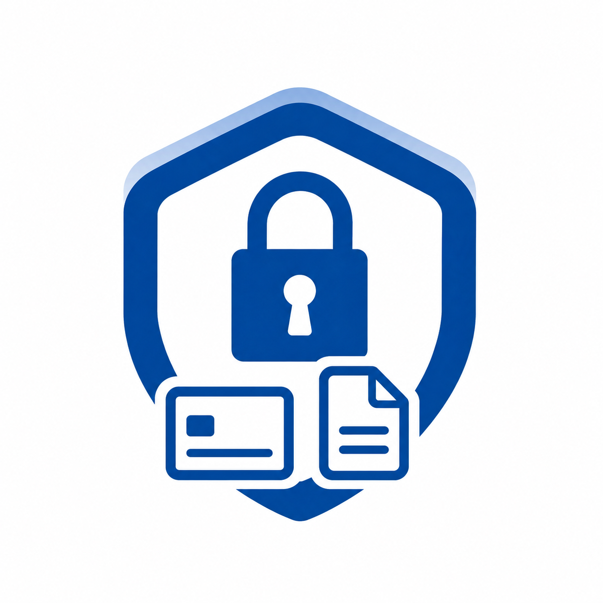

  
  <h1>SecureSyncZ</h1>
  
<strong>Zero-Knowledge Password, Credit Card & Secure Vault Manager</strong>

---

## 🛡️ Overview

**SecureSyncZ** is a modern, premium digital vault for securely storing and managing your passwords, credit cards, and notes. Engineered with zero-knowledge client-side cryptography, high-speed Next.js 16 architecture, and a mobile-first glassmorphism design, SecureSyncZ ensures your most critical digital credentials remain 100% private, accessible anywhere, and guarded by military-grade AES-GCM 256-bit encryption.

---

## ✨ Key Features

### 🔑 Vault Management & Organization
- **Smart Grouping:** 
  - **Passwords:** Intelligently grouped by Website / Root Domain (e.g., `google.com`, `github.com`) with clean multi-account browsing.
  - **Credit Cards:** Categorized by Card Type (`Visa`, `MasterCard`, `American Express`, `Discover`, `Others`).
  - **Secure Notes:** Encrypted rich text notes with tagging and favorites support.
- **Trash & Recovery:** Deleted credentials are moved to the Trash with instant recovery or permanent shredding options.

### ⚡ Built-in Password Generator
- **Dedicated Generator (`/generator`):** Create high-entropy, cryptographically random passwords tailored to any length (4 to 32 characters).
- **Custom Character Sets:** Full control over Uppercase (`A-Z`), Lowercase (`a-z`), Numbers (`0-9`), and Special Symbols (`!@#$%...`).
- **Live Strength Meter:** Real-time visual strength scoring (Weak, Medium, Strong, Very Strong).
- **One-Click Actions:** Instant clipboard copy with feedback and direct "Save to Vault" routing.
- **In-Form Generator:** Inline password generator directly inside the Add Credential form.

### 📦 Universal Backup, Import & Export
- **Multi-Platform CSV Export:**
  - **Google Chrome & Browsers:** Exports clean, standard CSV formatted specifically for Chrome, Safari, Edge, Firefox, and 1Password.
  - **Full Vault Backup:** Complete zero-knowledge export including Passwords, Cards, Notes, and custom tags.
- **Universal Smart Importer:** Drag-and-drop CSV import supporting Chrome, Safari, Bitwarden, and standard password manager exports with automatic column detection and client-side encryption.

### 📱 Responsive & Mobile-First Experience
- **Floating Bottom Navigation:** Smooth, dynamic floating bottom bar for rapid switching between **Passwords**, **Cards**, **Notes**, **Add**, and **Generator**.
- **Modern Sidebar Menu:** Quick access to **Vault Health**, **Profile**, **Dark/Light Theme**, **Secret Key Emergency Kit**, and **Data Management**.
- **Progressive Web App (PWA):** Installable on iOS, Android, macOS, and Windows for native app performance and offline UI availability.

### 🔍 Security & Health Analysis
- **Vault Health Dashboard:** Proactively scan your vault for compromised passwords (via HaveIBeenPwned API), duplicate passwords, and weak credentials.
- **Global Search (Cmd+K):** Instant fuzzy search across all passwords, card numbers, notes, and tags.

### 💳 Billing & Subscriptions
- **Stripe & Mobile In-App Purchases:** Integrated Stripe checkout and webhooks for premium tier subscriptions, alongside dedicated mobile billing verification endpoints.

---

## 🔐 Security Architecture

- **Zero-Knowledge Encryption:** Data is encrypted on the client side using **AES-GCM 256-bit** encryption _before_ transmission. Encryption keys are derived using **PBKDF2** with salted hashes. The server never sees or stores plaintext credentials.
- **Two-Secret Security Model:** Decryption requires both your **Master Password** and a device-level 64-character **Secret Key**.
- **Biometrics & WebAuthn:** Unlock your vault seamlessly using Touch ID, Face ID, Windows Hello, or a 6-digit PIN passkey.
- **Two-Factor Authentication (2FA / TOTP):** Secure login with standard Authenticator apps (Google Authenticator, Authy, etc.).
- **Rate Limiting:** Backend API endpoints protected against brute-force attacks via Upstash Redis.
- **Auto-Lock:** Vault automatically locks and purges decrypted keys from memory after inactivity.

---

## 🛠️ Tech Stack

- **Framework:** Next.js 16 (App Router & Turbopack)
- **Language:** TypeScript 5
- **Styling:** Tailwind CSS v4 & Vanilla CSS
- **Database:** MongoDB
- **Caching & Rate Limiting:** Upstash Redis
- **Media Storage:** Cloudinary
- **State & Fetching:** TanStack React Query v5
- **Authentication:** Custom JWT Auth, WebAuthn & Google OAuth
- **Cryptography:** Web Crypto API (SubtleCrypto: AES-GCM, PBKDF2, SHA-256)
- **Icons:** Lucide React
- **UI Components:** shadcn/ui & Radix UI

---

## 👨‍💻 Author / Credits

**MD. SAIF ISLAM**

- **Portfolio / Contact:** [developer-saif.vercel.app](https://developer-saif.vercel.app/)
- **GitHub:** [@muhammadsaif7717](https://github.com/muhammadsaif7717)

Feel free to reach out through the portfolio website for feedback, inquiries, or collaboration opportunities!

---

## 📄 License

This project and its source code are **strictly proprietary and confidential**.

While users are free to use the hosted SecureSyncZ platform to manage their credentials securely, **you are NOT permitted to clone, copy, modify, distribute, host, or create derivative works from this repository.**

This repository is public purely for portfolio showcase and verification purposes. See the [LICENSE](LICENSE) file for details.

---

  Built with ❤️ by <a href="https://developer-saif.vercel.app/">MD. SAIF ISLAM</a>

